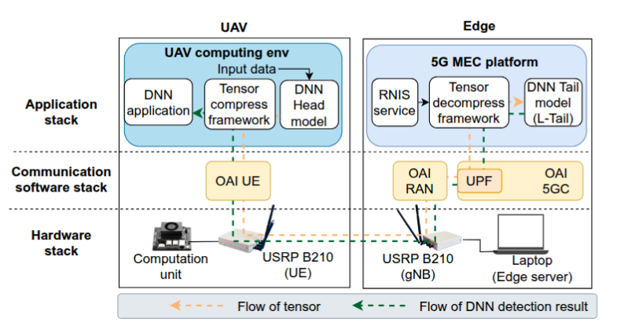

# CoTeD
CoTeD targets UAV–edge cooperative video object detection scenarios where a DNN is split between a resource-constrained UAV and a edge server over a private 5G network. It proposes a goal-oriented framework (as the figure below shows) that, **without model retraining**, can dynamically prunes, compresses, and reconstructs DNN activation tensors explicitly trading off radio bandwidth consumption against inference accuracy and latency in real time.


This repository contains the implementation and descriptions of the CoTeD framework and testbed presented in our publication:
>Yenchia Yu, Matteo Mendula, Marco Levorato, Marina Papatriantafilou, and Carla Fabiana Chiasserini. Efficient Tensor Compression and Reconstruction for Edge-Based Object Detection. {Publication info to be added}

## How to use this Repo

### Testbed setup
CoTeD framework is designed and evaluated on top of the testbed as the figure below shows.


The hardware devices used in the testbed includes:
* Nvidia Jetson Orin Nano (as the UAV computation unit)
* A laptop featuring an Intel I7-7700HQ CPU and Nvidia GTX 1050Ti GPU (as the edge server) 
* USRP B210 x2 (as the radio interface)

For the setup details, please follow the description in ```./testbed/``` folder.

### Running experiment


### Test with your own datasets